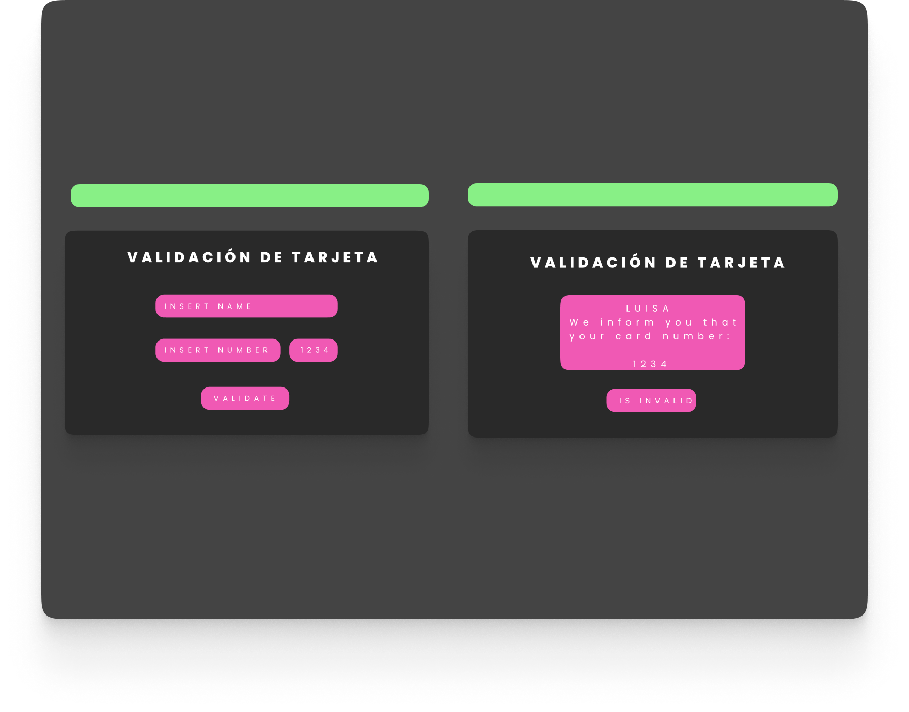

# DUPLA TC3-VALIDADOR

## REPOSITORIO DE TARJETA DE VALIDACIÓN

Nuestro proyecto se basa en una tarjeta de validación luego de 
hacer una compra en  la tienda de accesorios para personas interesadas en el mundo de los videojuegos 
o  de  accesorios gamer

### SOLUCION DEL PROBLEMA
Pueden hacer su pago virtual para hacerles ahorrar tiempo e ir a la tienda personalmente.

### RESPONSIVE

El DISEÑO lo adecuamos para que se viera en version MOVIL, TABLET y DESKTOP

## PROTOTIPO

## Despliegue  o descarga 🚀

[APPLICACION-TARJETA-DE-VALIDACIÓN](https://PaulaQR.github.io/Proyecto_TC3/src)

Puedes ir a este enlace para ver nuestra aplicacion directamente, 
Tambien puedes obtener el código clonandolo o descargando el ZIP 

### ¿ Cómo utilizar nuestra aplicación ? 

Vas a ingresar tú nombre de usuario,
Ingresas los datos de tú tarjeta al finalizar oprimes el botón de Validar y te saldrá 
si tú tarjeta es VALIDA o INVALIDA.

## Construido con 🛠️

### Prototipo
* [FIGMA]
### Funcionalidad - Estructura - Diseño
* [JAVASCRIPT]
* [HTML]
* [CSS]
### Editor de texto
* [VISUAL_STUDIO_CODE]

## Autores ✒️

* **Luisa Martinez** - [Luisa006](https://github.com/Luisa006)
* **Paula Quintero** - [PaulaQR](https://github.com/PaulaQR)

## Gratitud 🎁

* Gracias al equipo de Laboratoria por darnos la oportunidad de ser evaluadas, y por estar siempre
* para nosotras ! 

 
